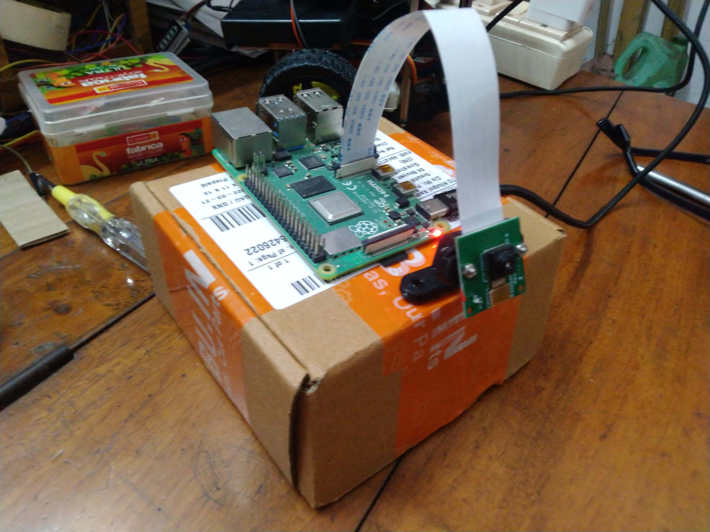
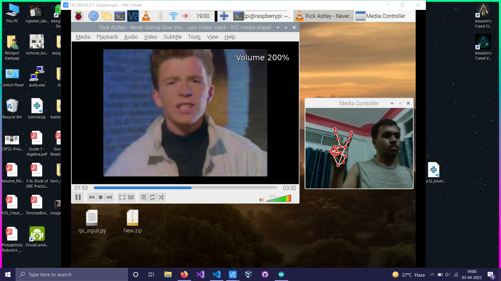
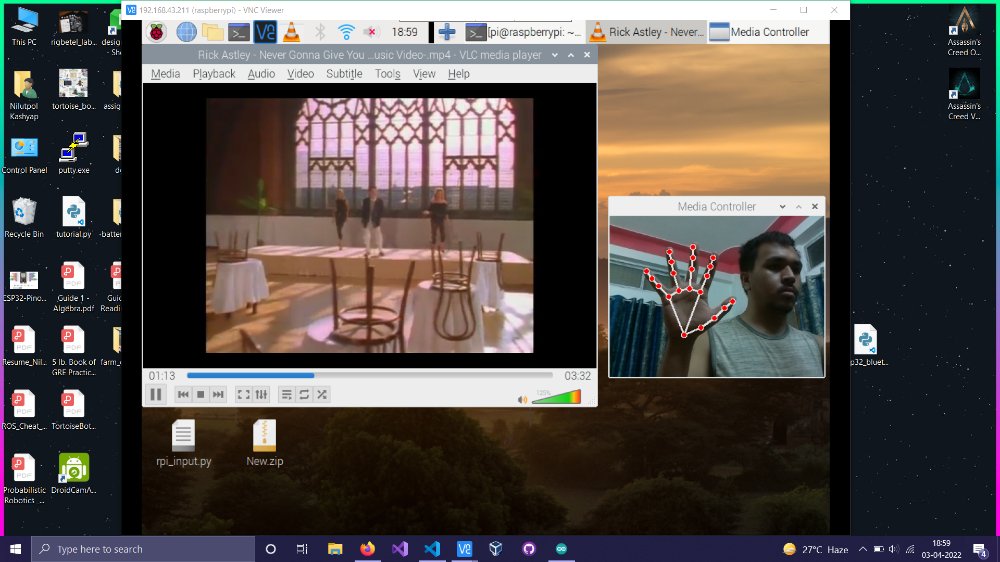

# Gesture Controlled Media Player

&nbsp;

## About  
It is a gesture-controlled media player that detects hand gestures and then executes commands. It is able to recognize hand gestures for executing commands such as Play , pause, 10 s forward, 10 s backward, Volume UP, Volume DOWN.

We used OpenCV and Mediapipe for capturing the images and recognition of the hand gestures. 

Finally we deployed the model on a Raspberry Pi 4 which can be used by anyone by just plugging it into a TV or monitor and to play media such as movies.  

## Software Used
- Python 3.x

## Libraries Used 
- pyautogui
- mediapipe (pip install mediapipe)
- opencv (pip install opencv-python)

## Hardware used

  

## Results 

  

 

  

 

 ## Output Video🎬 - https://youtu.be/DfZ_6rkmFas

Hackathon Submission Link - https://devpost.com/software/gesture-controlled-media-player

## Project Created by 
- Nilutpol Kashyap [nilutpolkashyap](https://github.com/nilutpolkashyap)
- Priyanka Kashyap [thepriyankakashyap](https://github.com/thepriyankakashyap)